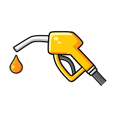

# COMP3120: Advanced Web Development
## Assignment 2: Fuel-Checker

  

### Description

Fuel-checker is a web application that keeps track of the fuel prices in the New South Wales area. Our target users are drivers or car owners in the state of New South Wales who require a one stop site to check all fuel prices. We made use of the data source provided by the [`New South Wales government`](https://api.nsw.gov.au/Product/Index/22).

The goal of this web application was to offer an alternative website for fuel tracking in the New South Wales are. We chose this goal as we found that the original fuel tracking website created by the New South Wales government wasn't created for desktop use. 

### Features 
Throughout the development of this project we were able to implement all the features we planned for the MVP of this web application. Listed in the table below are the main features we listed for the MVP and their status (Have they been achieved? Were they achieved on time?)

|Features|Status|
| --------------------------------------------- | --------------------------------------------------------------------------------------------------------------------------------------------------------------------------------------------------------------------------------------------- |
| Map & List view for Petrol Stations| Achieved on time by the allocated milestone date (Week 10).|
| User Account Creation |  Achieved on time by the allocated milestone date (Week 10). Achieved by using auth0. |
| Searching Stations by Location | Achieved on time by the allocated milestone date (Week 11). |
| Bookmark Stations | Achieved on time by the allocated milestone date (Week 11).|
| Fuel Price Graphs | Achieved on time by the allocated milestone date (Week 11). |

### Repository Structure

    ├── public        ├── favicon.ico
    ├                 ├── fuel.png
	├                 ├── header-splash.jpg
	├                 ├── index.html
	├                 ├── logo192.png
 	├                 ├── logo512.png
	├                 ├── manifest.json
	├                 └── robots.txt
	├
	├── SCREENSHOTS   ├── DashboardPage1.JPG
	├                 ├── DashboardPage2.JPG
	├                 ├── DashboardPage3.JPG
	├                 ├── DashboardPageSearch.JPG
	├                 ├── DashboardPageSearchResult.JPG
	├                 ├── GraphPage1.JPG
	├                 ├── GraphPage2.JPG
	├                 ├── GraphPage3.JPG
	├                 ├── Login.JPG
	├                 ├── MapPage1.JPG
	├                 ├── MapPage2.JPG
	├                 ├── MapPage3.JPG
	├                 ├── MapPageBookmarked.JPG
	├                 ├── NavBar.JPG
	├                 ├── ProfilePage.JPG
	├                 ├── README.MD
	├                 ├── StationPage1.JPG
	├                 ├── StationPage2.JPG
	├                 ├── StationsPage.JPG
	├                 ├── StationsPagePaginations1.JPG
	├                 ├── StationsPagePaginations2.JPG
	├                 ├── StationsPagePaginations3.JPG
	├                 ├── StationsPageSearch.JPG
	├                 └── UserDropDown.JPG			
	├
    ├── server        ├── controllers         ├── api.js
    ├                                         ├── appApi.js
    ├                                         ├── fuelApi.js
	├                                         └── userApi.js	
	├
    ├                 ├── models              ├── metrics.js
    ├                                         ├── prices.js
    ├                                         ├── stations.js
    ├                                         └── users.js
	├
	├                 ├── tests               ├── app.test.js
    ├                                         ├── fuelTypes.test.js
    ├                                         └── stations.test.js
	├
    ├                 ├── utils               ├── middleware.js
    ├                                         └── statistics.js
	├
	├                 ├── app.js
	├                 ├── sample.json
	├                 └── server.js
    ├
    ├
    ├── src           ├── components          ├── Bookmark.js
    ├                                         ├── FuelDropdown.js
	├                                         ├── FuelGraph.js
	├                                         ├── MapContainer.js
	├                                         ├── MetricCard.js
	├                                         ├── Navigation.js
	├                                         ├── Pin.js
	├                                         ├── StationInfoCard.js
	├                                         ├── StationList.js
	├                                         ├── StationListItem.js
	├                                         └── StationTable.js              
    ├
    ├                 ├── pages               ├── DashboardPage.js
	├                                         ├── DashboardPage.tests.js
	├                                         ├── GraphPage.js
	├                                         ├── MapPage.js
	├                                         ├── ProfilePage.js
    ├                                         └── StationInfoPage.js
    ├
	├                 ├── reducers            ├── userReducer.js
	├
	├                 ├── sass                ├── _variables.scss
    ├                                         └── App.scss
	├
	├                 ├── tests               ├── ___snapshots__           ├── app.test.js.snap
    ├                                         └── app.test.jss
	├
	├                 ├── services            ├── price.js
    ├                                         ├── station.tests.js
	├                                         ├── station.js
	├                                         └── user.js
	├
	├                 ├── utils               ├── Helpers.js
    ├                                         └── Layers.js
	├
    ├                 ├── App.js
    ├                 ├── App.test.js
    ├                 ├── index.js
    ├                 ├── reportWebVitals.js
    ├                 ├── setupTests.js
    ├                 └── store.js
    ├             
    ├── .eslintignore
    ├── .eslintrc.js
    ├── .gitignore
	├── craco.config.js
	├── DEPLOYMENT.md
    ├── LICENSE
    ├── package.json
    ├── Procfile
    ├── README.md
    └── yarn.lock
   

### Libraries
| Package name                                  | Description                                                                                                                                                                                                                                   |
| --------------------------------------------- | --------------------------------------------------------------------------------------------------------------------------------------------------------------------------------------------------------------------------------------------- |
| [`react`](https://reactjs.org/)  | A JavaScript library for building user interfaces. |
| [`react-router-dom`](https://github.com/remix-run/react-router)     | React Library that allows for dynamic routing. |
| [`react-dom`](https://reactjs.org/docs/react-dom.html)    | A package that provides DOM-specific methods that can be used at the top level of an app. |
| [`react-bootstrap`](https://react-bootstrap.github.io/)    | Popular frontend framework. |
| [`axios`](https://axios-http.com/)    | A simple promise based HTTP client for the browser and node.js. |
| [`react-markdown`](https://github.com/remarkjs/react-markdown)    | Markdown component for React using remark. |
| [`express`](http://expressjs.com/)    | A minimal and flexible Node.js web application framework. |
| [`cors`](https://github.com/expressjs/cors)    | A node.js package for providing a Connect/Express middleware that can be used to enable CORS with various options. |
| [`auth0-react`](https://auth0.com/)    | Third-party authentication and authorization platform. |
| [`react-map-gl`](https://visgl.github.io/react-map-gl/) | A suite of components designed to provide a React API for Mapbox GL JS-compatible libraries. |
| [`react-map-gl-geocoder`](https://www.npmjs.com/package/react-map-gl-geocoder)    | React wrapper for mapbox-gl-geocoder for use with react-map-gl. |
| [`recharts`](https://recharts.org/en-US/)    | A composable charting library built on React components. |
| [`node-cron`](https://www.npmjs.com/package/node-cron)    | A tiny task scheduler in pure JavaScript for node.js based on GNU crontab. |
| [`express`](https://expressjs.com/)    | A minimal and flexible Node.js web application framework. |
| [`bcrypt`](https://www.npmjs.com/package/bcrypt)    | A library to help hash passwords. |
| [`jsonwebtoken`](https://www.npmjs.com/package/jsonwebtoken)    | An implementation of Json Web Tokens. |
| [`sass`](https://sass-lang.com/)    | A stable, and powerful professional grade CSS extension . |
| [`redux`](https://redux.js.org/)    | A predictable state container for JS Apps. |
| [`moment`](https://momentjs.com/)    | A library that parses, validate, manipulate and display dates and times in JavaScript. |
| [`supertest`](https://www.npmjs.com/package/supertest)    | A module that provides high-level abstraction for testing HTTP. |
| [`mongoose`](https://mongoosejs.com/)    | Provides a straight-forward, schema-based solution to model application data. |

### Custom Components

#### [Bookmark](src/components/Bookmark.js)
Bookmark Component - Used to save specific petrol stations

#### [FuelDropdown](src/components/FuelDropdown.js)
Dropdown Component - Used to select specific fuel 

#### [FuelGraph](src/components/FuelGraph.js)
Graph Component - Used to render and display fuel prices in graph form

#### [MapContainer](src/components/MapContainer.js)
Container Component - The container for the map

#### [MetricCard](src/components/MetricCard.js)
Card Component - Displays the fuel metrics in card container

#### [Navigation](src/components/Navigation.js)
Bar Component - The navigation bar

#### [Pin](src/components/Pin.js)
Pin Component - Represents bookmarked petrol stations on the map

#### [StationInfoCard](src/components/StationInfoCard.js)
Card Component - Shows specific petrol station information

#### [StationList](src/components/StationList.js)
List Component - List of stations

#### [StationListItem](src/components/StationListItem.js)
Item Component - Specific stations in the lsit

#### [StationTable](src/components/StationTable.js)
Table Component - Displays the list of stations in table form

### Pages

#### [DashboardPage](src/pages/DashboardPage.js)
The landing page of the web application. Shows the recent metrics of specific fuel types. Additionally has a search bar to search petrol stations near the specified location.

#### [GraphPage](src/pages/GraphPage.js)
Displays the recent fuel trends in graph form. Users can change the fuel type to display on a graph.

#### [MapPage](src/pages/MapPage.js)
Contains the map where all petrol stations at NSW is displayed.

#### [ProfilePage](src/pages/ProfilePage.js)
Displays the user profile, including all their bookmarked stations.

#### [StationInfoPage](src/pages/StationInfoPage.js)
Displays the address of the chosen petrol station as well as all the prices of the available fuel in said location.

### Future of the Project
In the future, a number of new features could be added to the project. One such feature could be transforming the application into a PWA, so that users can install the application on their device and save data offline. Another potential feature that could be added to the project could be notifications, allowing users to recieve a push notification when the fuel price changes at one of their bookmarked petrol stations.
